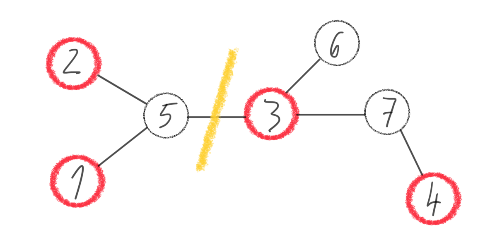
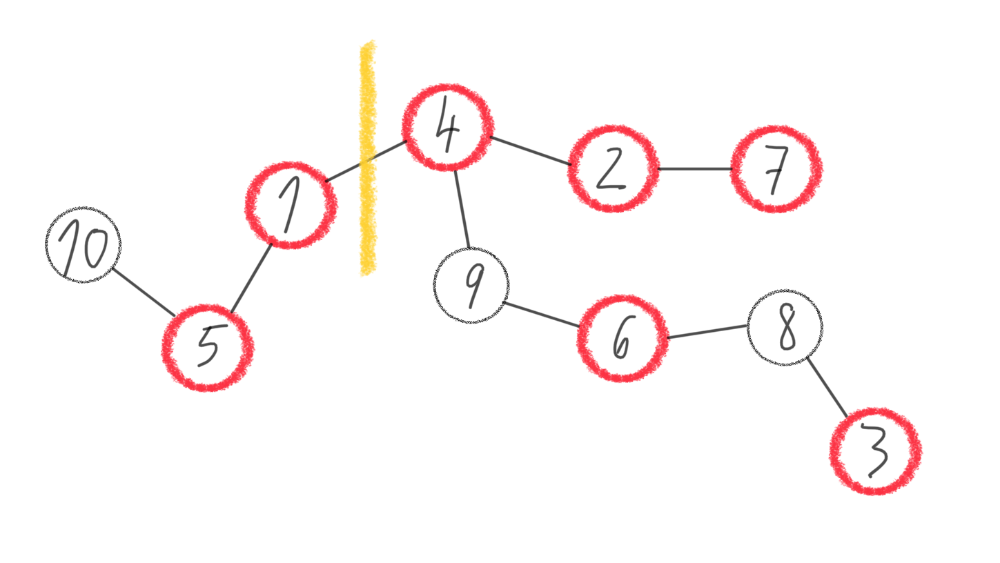

## Task

#### Bead cutting

 Suzanne and Anne find the ground several large beads connected by strings into a continuous whole. It is probably a toy of their mother or grandmother. On closer inspection, they see that the beads are of two colors, white and red. The strings always connect a pair of beads. It can be seen that one, two or three strings emanate from each bead. Their father would say that the whole structure of beads and strings can be described as a continuous graph without cycles, ie a tree, with each node being a maximum of 3 edges. The girls really like red beads, they are not very interested in white beads. They think about how to divide the finding as fairly as possible, but at the same time they don't want to do much damage. They agree to cut only one string and each of them will take one of the two parts created. They want to choose a string to cut so that the difference in the number of red beads in both parts is as small as possible.

  
  

#### Input (example)

`7 4`   number of all beads & number of red beads   
`1 5`  
`5 2`  
`4 7`  
`3 6`  
`7 3`  
`5 3`   list of ([number fo all beads] - 1) bead pairs connected by string (edges) 

#### Output (example)

`3 5`  pair of edges connected by string that should be cut (ordered ascending) 

## Solution

